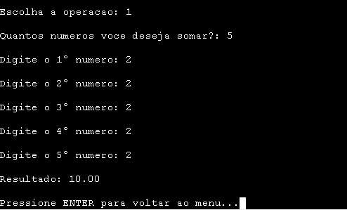
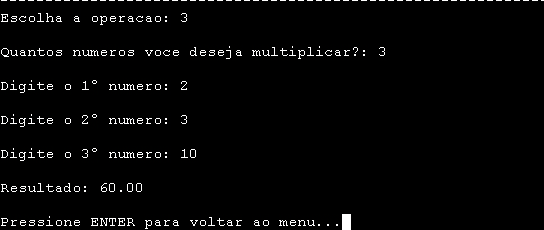
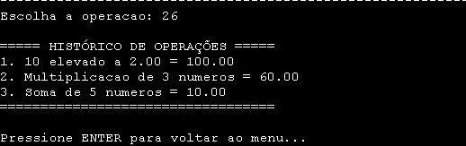

```
											   _____________________
											  |  _________________  |
											  | | JO           0. | |
											  | |_________________| |
											  |  ___ ___ ___   ___  |
											  | | 7 | 8 | 9 | | + | |
											  | |___|___|___| |___| |
											  | | 4 | 5 | 6 | | - | |
											  | |___|___|___| |___| |
											  | | 1 | 2 | 3 | | x | |
											  | |___|___|___| |___| |
											  | | . | 0 | = | | ÷ | |
											  | |___|___|___| |___| |
											  |_____________________|
```

# 🧮 Calculadora Científica


---

## ❓ O que é ❓
> Esta é uma calculadora científica desenvolvida em C, que realiza operações básicas e avançadas, como soma, subtração, multiplicação, divisão, potenciação, fatorial, funções trigonométricas, cálculo da constante de Euler e mais.

> O programa foi estruturado usando structs e arrays para organizar os números e o histórico de operações, além de utilizar funções (void) para exibir o menu e registrar o histórico, tornando o código mais modular e fácil de manter.

---

## 👨‍💻 Tecnologias

- Linguagem: C  
- Bibliotecas: `<math.h>`, `<stdlib.h>`, `<stdio.h>`, `<string.h>`
- IDE: GDB Online

---

## ⚙️ Como Executar
1. Abra o código no seu compilador C (Dev C++, Code::Blocks ou GDB Online).  
2. Compile o programa:  
```bash
gcc calculadora_cientifica.c -o calculadora -lm
```
3. Execute:
```bash
./calculadora
```
4. Escolha a operação desejada no menu e siga as instruções na tela.

---

## 🔎 Exemplos de Uso 

<p align="center">  </p> 
<p align="center">  </p> 
<p align="center">  </p>

---

## 💡 Observações

- O programa utiliza menu interativo, permitindo que o usuário execute múltiplas operações sem reiniciar.
- O programa permite que o usuário veja as ultimas operações que ele fez através do histórico.
- Funciona em qualquer compilador C que suporte a biblioteca <math.h>.
- Use -lm ao compilar para incluir a biblioteca matemática.
